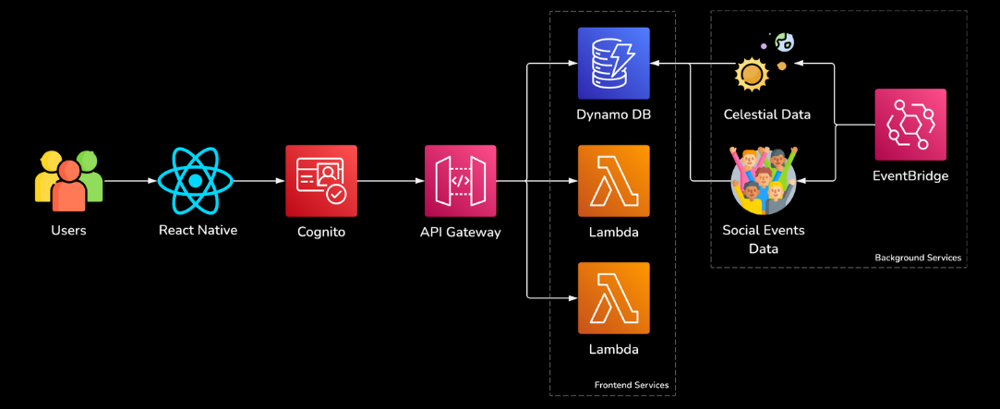

# Lumina

> A full-stack mobile app that makes stargazing planning effortless by bringing celestial events, weather-aware recommendations, and community experiences into one place.

---

## What It Does

Lumina is a stargazing companion app designed around a simple insight: finding the right night to look up at the sky should feel exciting, not like research homework.

Instead of bouncing between scattered weather apps, astronomy calendars, and social platforms, Lumina brings those pieces together into one guided mobile experience.

**Core features (in progress):**

- Discover upcoming celestial events like meteor showers, eclipses, and alignments
- Use weather-aware planning to surface better nights for clear skies
- Browse astronomy-related social and community events nearby
- Track upcoming sky events in a calendar view
- Support authentication and personalized profiles through AWS Amplify

---

## Architecture Overview

Lumina is built as a connected full-stack product across a React Native Expo frontend and an AWS-backed serverless backend.

| Layer | Stack |
|---|---|
| **Mobile Frontend** | React Native, Expo, AWS Amplify |
| **Auth and Cloud** | AWS Amplify, Cognito, AppSync |
| **Backend and Data** | Node.js service scripts for event ingestion, celestial updates, and recommendation logic |
| **Infrastructure** | AWS Lambda, DynamoDB, API Gateway, S3 |

---

## Repository Structure

The repo is now split into clear product boundaries:

- **`/frontend`** - Expo mobile app, screens, assets, Amplify config, and native project files
- **`/backend`** - standalone scripts for celestial ingestion, social event aggregation, and recommendation logic
- **`/frontend/amplify`** - AWS Amplify configuration for auth and cloud feature wiring used by the mobile app

---

## Team

| Role | Name |
|---|---|
| Frontend | Mercedes Xiong, Shriya Kalyan |
| Backend | Bilal Tulek, Tanishq Akasapu |

*Built for anyone who has ever looked up at the night sky and wanted to know what they were seeing.*
